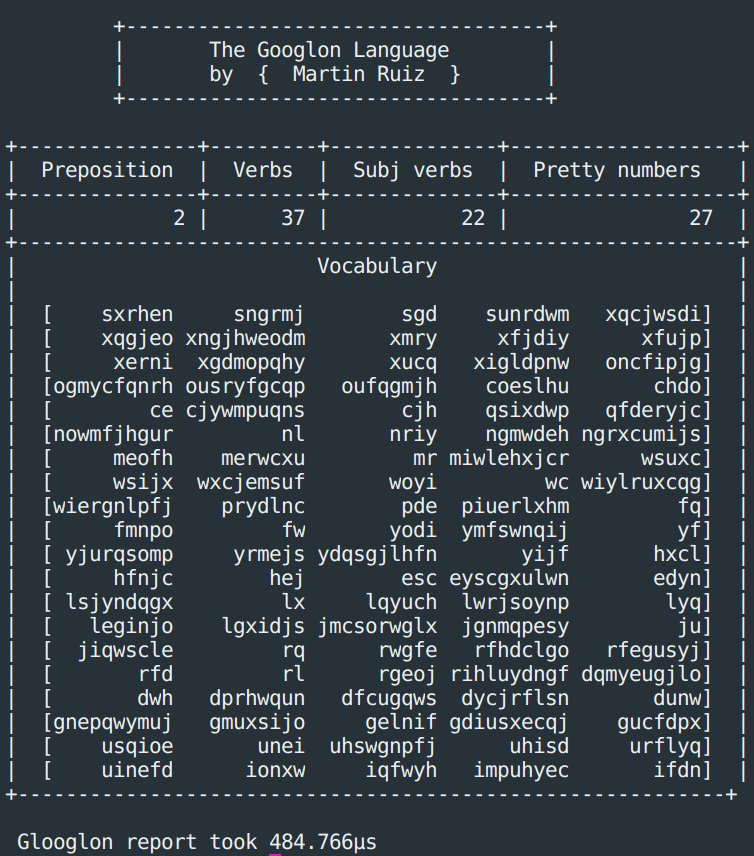

# Googlon Language 

-----

Go CLI application to obtain insights from ancient scrolls in the mysterious Googlon language.





## Getting started


### Requirements

* [Go 1.12v](https://golang.org/dl/)


### Build

```
> go build *.go
```

 

### Build and run

```
> go run *.go ../test/data/test_a.txt
```


### Run 

```
> ./main ../test/data/test_a.txt 
```


**Note:** You can change **`../test/data/test_a.txt`** with any **.txt** file that you want to test


## Author

- Martín Ruíz [@martinrzg](https://github.com/martinrzg)

  

-----

